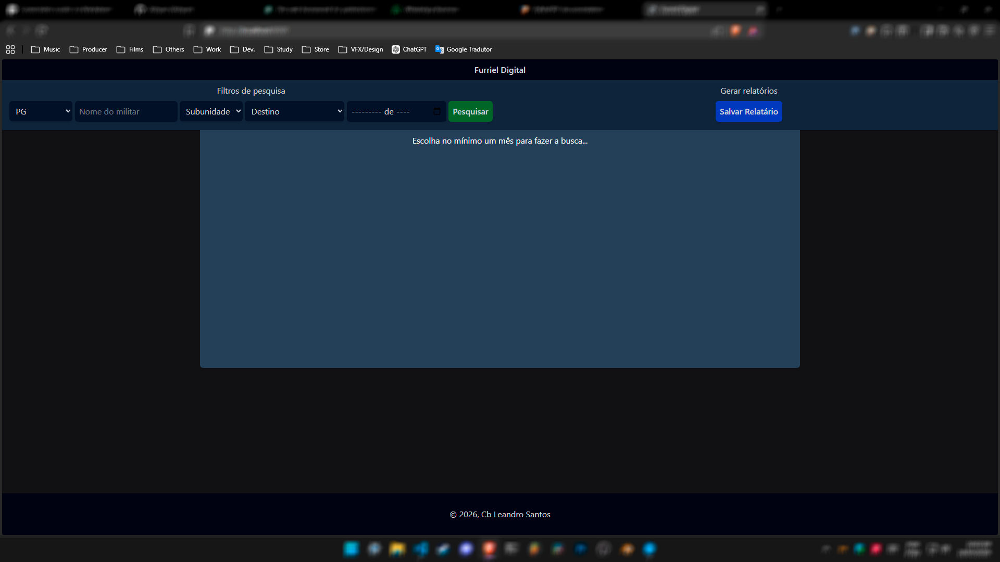
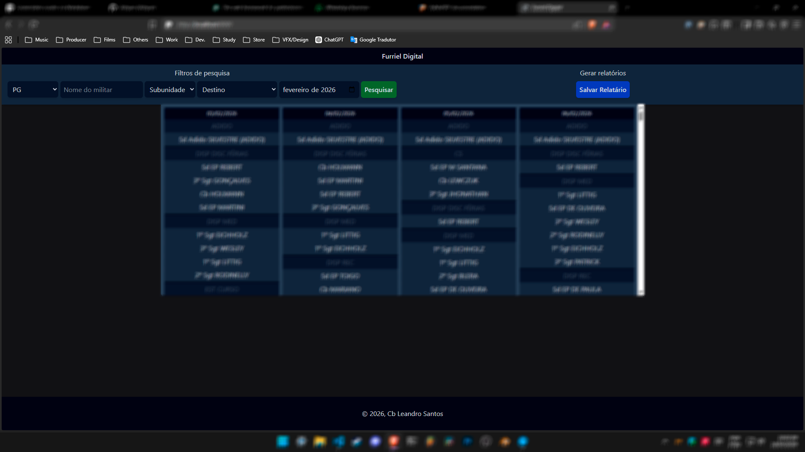
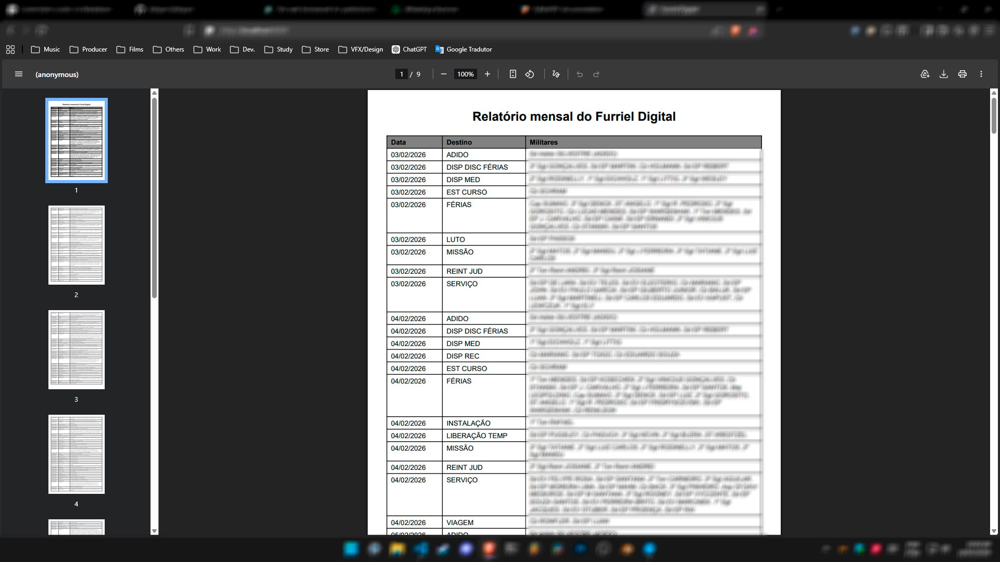

# Furriel Digital

> O sistema foi desenvolvido para uma unidade militar e tem como propósito auxiliar o furriel das subunidades, facilitando o trabalho de desconto do auxílio-transporte nos dias em que o militar estiver de serviço ou, por outro motivo, não fizer uso do benefício.

---

## Sumário

1. [Sobre](#sobre)
2. [Funcionalidades](#funcionalidades)
3. [Tecnologias Utilizadas](#tecnologias-utilizadas)
4. [Requisitos](#requisitos)
5. [Instalação](#instalação)
6. [Configuração](#configuracao)
7. [Uso](#uso)
8. [Estrutura do Projeto](#estrutura-do-projeto)
9. [Créditos](#creditos)
10. [Licença](#licença)
11. [Outros](#outros)
12. [Telas do Sistema](#telas-do-sistema)

---

## Sobre

Sa principal fonte de dados é o banco de dados do sistema [SISCONEF](https://github.com/Xzhyan/SISCONEF_Sistema_de_Controle_de_Efetivo), que foi desenvolvido para a mesma unidade militar e tem o papel de controlar os destinos do efetivo da unidade. Ou seja, os dois sistemas trabalham em conjunto.

---

## Funcionalidades

O sistema exibe relatórios mensais dos militares e seus respectivos destinos, com o objetivo de auxiliar o furriel em suas atividades administrativas. Além disso, possui diversos filtros que permitem realizar buscas específicas e exibir informações úteis de forma rápida e organizada.

Também é capaz de gerar relatórios em PDF contendo todos os dados consultados, facilitando o trabalho do furriel com as informações necessárias para o controle e conferência.

O sistema ainda conta com uma funcionalidade adicional, que pode ser considerada "oculta", responsável por realizar a leitura de múltiplos documentos PDF em busca de um nome específico. Sempre que o nome é encontrado em uma página, essa página é extraída e, ao final do processo, é gerado um único documento contendo todas as páginas nas quais o nome aparece.

---

## Tecnologias Utilizadas

Toda a base do projeto é desenvolvida em Python, utilizando principalmente o framework Django e bibliotecas Python responsáveis por funcionalidades específicas, como geração e manipulação de relatórios em PDF, leitura de documentos e processamento de dados.

- [Django](https://www.djangoproject.com/) — Framework web em Python utilizado para o desenvolvimento da estrutura principal do sistema, gerenciamento de rotas, regras de negócio, banco de dados e interface administrativa.

- [PyMuPDF](https://pymupdf.readthedocs.io/en/latest/) — Biblioteca Python utilizada para leitura, manipulação e extração de informações de arquivos PDF, incluindo a busca por textos específicos e separação de páginas.

- [reportlab](https://pypi.org/project/reportlab/) — Biblioteca Python utilizada para geração de relatórios em PDF de forma programática, permitindo criar documentos personalizados com textos, tabelas e formatação.

---

## Requisitos

Os requisitos básicos para a utilização do sistema são possuir uma máquina com o ambiente devidamente preparado, contendo o Python instalado, as bibliotecas necessárias configuradas e estar conectada à mesma rede do sistema SISCONEF, para possibilitar o acesso ao seu banco de dados.

---

## Instalação

Como o sistema possui um objetivo específico e foi desenvolvido para uso em unidades militares, a instalação e configuração podem ser acompanhadas e orientadas por mim. Para isso, basta entrar em contato.

---

## Configuração

Como o sistema possui um objetivo específico e foi desenvolvido para uso em unidades militares, a instalação e configuração podem ser acompanhadas e orientadas por mim. Para isso, basta entrar em contato.

---

## Uso

Na tela inicial, o principal filtro é o de mês, já que todas as buscas e relatórios do sistema são realizados mensalmente, sendo esse o padrão de uso pelo furriel da subunidade.

Existem outros filtros que permitem realizar buscas mais específicas, como: nome, graduação, subunidade e destino.

Após selecionar os filtros desejados, utilize o botão verde **"Pesquisar"**. Uma lista com as informações correspondentes será exibida e, para gerar o PDF com esses dados, utilize o botão azul **"Salvar Relatório"**.

O uso do sistema é simples e intuitivo.

---

## Estrutura do Projeto

Basicamente, o projeto possui a pasta principal padrão de todo projeto Django chamada **core**, onde ficam os principais códigos e configurações do sistema. 

Há também um app chamado **furriel**, responsável pelos códigos e templates da tela principal do sistema, e um app chamado **scan**, onde está implementada a funcionalidade de leitura e varredura de documentos PDF.

---

## Créditos

O sistema foi desenvolvido por [Xzhyan](https://github.com/Xzhyan)

---

## Licença

A utilização deste sistema para fins comerciais é estritamente proibida sem a autorização prévia do proprietário, [Xzhyan](https://github.com/Xzhyan).

O sistema foi desenvolvido especificamente para uso em unidades militares, sendo destinado exclusivamente a esse ambiente operacional.

---

## Outros

Baixar as bibliotecas Python listadas no `requirements.txt` para serem instaladas em um ambiente sem conexão externa.
```bash
pip download -r requirements.txt --python-version 313 --platform win_amd64 --only-binary=:all: -d pack
```

Instalar as bibliotecas Python baixadas.
```bash
pip install --no-index --find-links=pack -r requirements.txt
```

Rodar o tailwindcss.exe para compilar os estilos a partir do input.css, para não depender de CDN.
```bash
tailwindcss.exe -i ./furriel/static/furriel/input.css -o ./furriel/static/furriel/output.css --watch --content "./**/*.html"
```

---

## Telas do sistema



